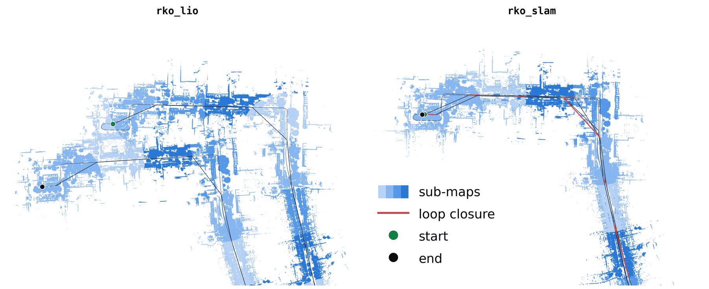
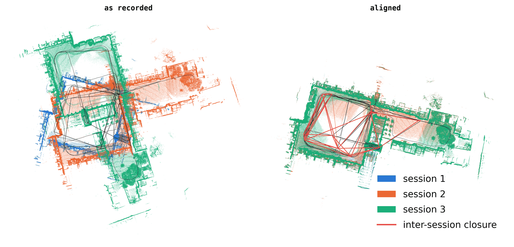

<h1 align="center">rko_slam</h1>
<h3 align="center">ROS2 LiDAR-inertial SLAM for your odometry: drift correction and multi-session alignment</h3>

<div align="center">

[](https://github.com/PRBonn/rko_slam/actions/workflows/ros_jazzy.yaml)
[](https://github.com/PRBonn/rko_slam/actions/workflows/ros_kilted.yaml)
[](https://github.com/PRBonn/rko_slam/actions/workflows/ros_lyrical.yaml)
[](https://github.com/PRBonn/rko_slam/actions/workflows/ros_rolling.yaml)

[](https://prbonn.github.io/rko_slam/)
[](/LICENSE)
[](/)

</div>

<p align="center">
  <picture>
    <source media="(prefers-color-scheme: dark)" srcset="docs/_static/img/readme_loop_closing_dark.png">
    
  </picture>
  <br />
  <em>A 3 km drive that ends where it started, with rko_lio, and with rko_slam running on top of it</em>
</p>

rko_slam is a ROS2 LiDAR-inertial SLAM system. It runs on top of a LiDAR-inertial odometry. An odometry tells you how
you moved, and over a long enough run its estimate drifts: come back to a place you have been before and the two visits
do not land on the same spot. rko_slam runs next to the odometry, uses the LiDAR and IMU, recognizes the revisit, and
corrects the whole trajectory behind you. You keep the odometry as it is, and you additionally get a `map <- odom`
correction on TF, a pose graph, and the sub-maps the system built along the way.

The odometry it assumes by default is [rko_lio](https://github.com/PRBonn/rko_lio), my LiDAR-inertial odometry package,
which is also a build dependency. At run time any odometry that publishes `odom <- base` on TF and is locally consistent
will do - LiDAR-only odometry, wheel odometry, whatever you already run. The IMU is optional as well: leave `imu_topic`
unset and rko_slam runs on the LiDAR alone.

The same revisit detector works across runs, not just within one, as an offline step. Give it the run directories of
several sessions of the same place - different days, different directions, whatever - and it finds where they overlap
and solves all of them into one frame.

<p align="center">
  <picture>
    <source media="(prefers-color-scheme: dark)" srcset="docs/_static/img/readme_multi_session_dark.png">
    
  </picture>
  <br />
  <em>Three sessions of the same place, recorded on different days, and the one frame they end up in</em>
</p>

Documentation is at [prbonn.github.io/rko_slam](https://prbonn.github.io/rko_slam/).

## Build

Supported distros: Jazzy, Kilted, Lyrical, Rolling.

For now, rko_lio has to be built in the same workspace.

```bash
cd <ws>/src
git clone https://github.com/PRBonn/rko_lio
git clone https://github.com/PRBonn/rko_slam
cd <ws> && rosdep install --from-paths src --ignore-src -y
colcon build --packages-select rko_lio rko_slam
```

`apt` installs will be supported, same as with rko_lio. Dependencies and build options are covered in the
[docs](https://prbonn.github.io/rko_slam/master/pages/build_and_run.html).

## Usage

Three entrypoints: `slam.launch.py` (`mode:=online|offline`), `odometry_and_slam.launch.py`, and `align.launch.py`. `-s`
lists every parameter with its documentation, and anything you leave unset keeps the node's own default.

Online, next to a running rko_lio, consuming its deskewed scan:

```bash
ros2 launch rko_slam slam.launch.py lidar_topic:=/rko_lio/deskewed_scan imu_topic:=/your/imu rviz:=true
```

Offline, self-draining a bag, with the odometry from the bag's own `/tf`, and writing the run to disk:

```bash
ros2 launch rko_slam slam.launch.py mode:=offline bag_path:=/data/my_bag \
  lidar_topic:=/rko_lio/deskewed_scan imu_topic:=/your/imu dump_results:=true
```

Multi-session alignment of the run directories those runs wrote:

```bash
ros2 launch rko_slam align.launch.py run_dirs:="[results/run_1, results/run_2]"
```

Running with another odometry, running rko_lio alongside with `odometry_and_slam.launch.py`, taking the odometry from a
TUM file, what a run writes to disk, every parameter and what it does, and how the system works are all in the
[docs](https://prbonn.github.io/rko_slam/).

## Acknowledgments and Citation

This work was developed as part of my thesis (published soon), and much of it is inspired by
[KISS-SLAM](https://github.com/PRBonn/kiss-slam) - the initial version was essentially a reimplementation for ROS2.
rko_slam also relies heavily on [rko_lio](https://github.com/PRBonn/rko_lio), my lidar inertial odometry package, for
much of its internals.

If you find this package useful, consider leaving a star ⭐ here and on KISS-SLAM, and citing the original publication:

```bib
@INPROCEEDINGS{kiss2025iros,
  author    = {Guadagnino, Tiziano and Mersch, Benedikt and Gupta, Saurabh and Vizzo, Ignacio and Grisetti, Giorgio and Stachniss, Cyrill},
  booktitle = {2025 IEEE/RSJ International Conference on Intelligent Robots and Systems (IROS)},
  title     = {{KISS-SLAM: A Simple, Robust, and Accurate 3D LiDAR SLAM System With Enhanced Generalization Capabilities}},
  year      = {2025},
  pages     = {5363-5370},
  doi       = {10.1109/IROS60139.2025.11246613}
}
```

If you found the default odometry, i.e., rko_lio useful, consider leaving a star ⭐ there and citing the corresponding
publication:

```bib
@article{malladi2026ral,
  author      = {M.V.R. Malladi and T. Guadagnino and L. Lobefaro and C. Stachniss},
  title       = {A Robust Approach for LiDAR-Inertial Odometry Without Sensor-Specific Modeling},
  journal     = {IEEE Robotics and Automation Letters},
  year        = {2026},
  volume      = {11},
  number      = {6},
  pages       = {7420--7427},
  doi         = {10.1109/LRA.2026.3685966},
}
```

## License

This project is free software made available under the MIT license. For details, see the [LICENSE](LICENSE) file.
