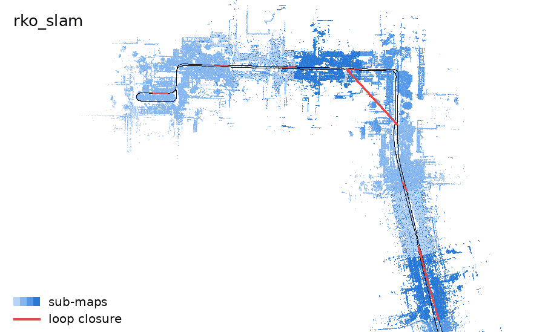
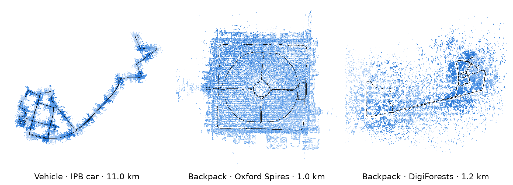
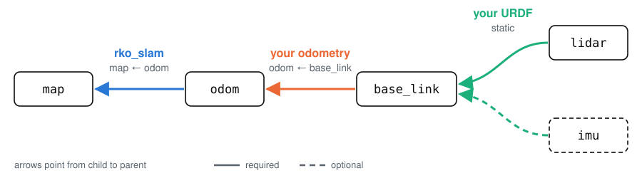
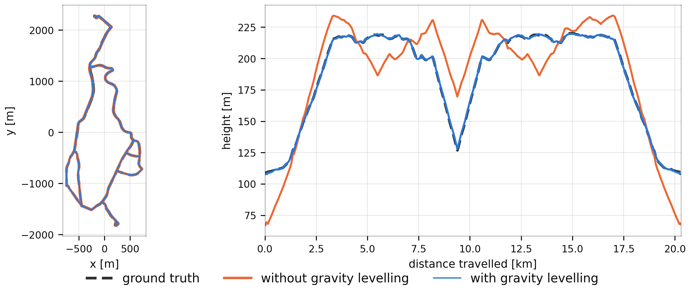
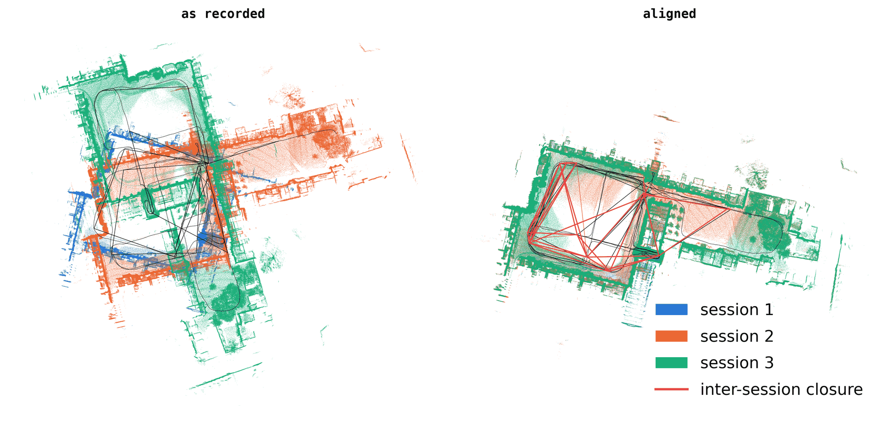

<h1 align="center">rko_slam</h1>
<h3 align="center">ROS2 LiDAR-inertial SLAM and multi-session alignment</h3>

<div align="center">

[](https://github.com/PRBonn/rko_slam/actions/workflows/ros_jazzy.yaml)
[](https://github.com/PRBonn/rko_slam/actions/workflows/ros_kilted.yaml)
[](https://github.com/PRBonn/rko_slam/actions/workflows/ros_lyrical.yaml)
[](https://github.com/PRBonn/rko_slam/actions/workflows/ros_rolling.yaml)

[](https://prbonn.github.io/rko_slam/)
[](/LICENSE)
[](/)

</div>

<p align="center">
  <picture>
    <source media="(prefers-color-scheme: dark)" srcset="docs/_static/img/readme_loop_closing_dark.gif">
    
  </picture>
  <br />
  <em>A drive that returns to where it started, with rko_lio, and with rko_slam running on top of it</em>
</p>

<p align="center">
  <picture>
    <source media="(prefers-color-scheme: dark)" srcset="docs/_static/img/readme_platforms_dark.png">
    
  </picture>
</p>

## Quick start

rko_slam runs on [rko_lio](https://github.com/PRBonn/rko_lio), my LiDAR-inertial odometry, or on your own odometry.
Build it with rko_lio:

```bash
cd <ws>/src
git clone https://github.com/PRBonn/rko_lio
git clone https://github.com/PRBonn/rko_slam
cd <ws> && rosdep install --from-paths src --ignore-src -y
colcon build --packages-select rko_lio rko_slam
```

### What it needs

- A LiDAR (`sensor_msgs/PointCloud2` with per-point timestamps) and an IMU (`sensor_msgs/Imu`).
- The LiDAR and IMU frames linked to your base frame on TF, e.g. by your URDF.

<p align="center">
  <picture>
    <source media="(prefers-color-scheme: dark)" srcset="docs/_static/img/readme_tf_tree_dark.svg">
    
  </picture>
</p>

### Run

`odometry_and_slam.launch.py` starts rko_lio and rko_slam together and finds the LiDAR and IMU topics and your base
frame by itself. Start your robot, then:

```bash
ros2 launch rko_slam odometry_and_slam.launch.py rviz:=true
```

From a bag, in two terminals, bag first:

```bash
ros2 bag play <bag> --clock
ros2 launch rko_slam odometry_and_slam.launch.py use_sim_time:=true rviz:=true
```

If your setup differs:

| Your setup                                                                                                         | Do this                                                        |
| ------------------------------------------------------------------------------------------------------------------ | -------------------------------------------------------------- |
| Base frame named other than `base_link`, `base_footprint` or `base`                                                | `base_frame:=<yours>`                                          |
| Several LiDAR or IMU topics, e.g. the LiDAR driver's own IMU                                                       | an rko_lio config file naming yours and your base frame, below |
| LiDAR and IMU messages share one `frame_id` and no TF links it to a base frame, e.g. a Livox with its built-in IMU | an rko_lio config file with identity extrinsics, below         |
| Topics or TF take over 10 s to appear                                                                              | `autodetect_timeout:=<seconds>`                                |
| Something else already publishes `odom <- <your base frame>`, e.g. robot_localization or the bag's `/tf`           | turn it off, or run with your own odometry, below              |

An rko_lio config file, passed with `rko_lio_config_file:=<file>`, replaces the autodetection
([all keys](https://prbonn.github.io/rko_lio/pages/config.html)):

```yaml
lidar_topic: /livox/lidar
imu_topic: /livox/imu
# LiDAR and IMU in one frame, no TF
base_frame: livox_frame
extrinsic_lidar2base_quat_xyzw_xyz: [0.0, 0.0, 0.0, 1.0, 0.0, 0.0, 0.0]
extrinsic_imu2base_quat_xyzw_xyz: [0.0, 0.0, 0.0, 1.0, 0.0, 0.0, 0.0]
```

### With your own odometry

`slam.launch.py` starts rko_slam alone, on any locally consistent odometry that publishes `odom <- base_link` on TF:

```bash
ros2 launch rko_slam slam.launch.py lidar_topic:=/points imu_topic:=/imu base_frame:=base_link deskew:=true
```

If your setup differs:

| Your setup                                        | Do this                                                                    |
| ------------------------------------------------- | -------------------------------------------------------------------------- |
| Scans already deskewed                            | `deskew:=false`, the default                                               |
| LiDAR and IMU in one frame, no TF to a base frame | `base_frame:=<that frame>`; your odometry publishes `odom <- <that frame>` |
| Odometry frame named other than `odom`            | `odom_frame:=<name>`                                                       |
| Odometry publishes `base_link <- odom`            | `invert_map_tf:=true`                                                      |
| No IMU                                            | leave out `imu_topic`                                                      |

With an IMU, gravity levelling improves the map:

<p align="center">
  <picture>
    <source media="(prefers-color-scheme: dark)" srcset="docs/_static/img/readme_gravity_levelling_dark.png">
    
  </picture>
  <br />
  <em>A 20 km drive against ground truth, the same odometry under both runs: in height, the run without gravity levelling
  swings through ±40 m, the one with it stays within a few metres</em>
</p>

### Settings

- `dump_results:=true` writes the run to `results/<run_name>_<n>/`: each sub-map as it closes, then the trajectory and
  pose graph on shutdown.
- `splitting_distance` (50 m): a new sub-map starts at this straight-line distance from the last one's start, and a loop
  closes against a sub-map four or more back, set by `no_of_sub_maps_to_skip` (3, at least 1): at the defaults, a loop
  shorter than about 200 m never closes. For a small area, lower either, e.g. `splitting_distance:=30`.
- `overlap_threshold` (0.4): how much two sub-maps must overlap for a closure. Raise it where places look alike.

`ros2 launch rko_slam slam.launch.py -s` lists every rko_slam parameter. Offline processing, odometry from a TUM file,
every output: [documentation](https://prbonn.github.io/rko_slam/).

## Multi-session alignment

<p align="center">
  <picture>
    <source media="(prefers-color-scheme: dark)" srcset="docs/_static/img/readme_multi_session_dark.png">
    
  </picture>
  <br />
  <em>Three sessions of the same place, recorded on different days, and the one frame they end up in</em>
</p>

Run each session with `dump_results:=true run_name:=day_1` (`day_2`, ...), then:

```bash
ros2 launch rko_slam align.launch.py run_dirs:="[results/day_1_0, results/day_2_0]"
```

It writes each session's trajectory in the joint frame and the joint pose graph to `results/aligned_<n>/`.

## Citation

If rko_slam is useful to you, leave a star ⭐.

rko_slam is part of my PhD thesis. Until the thesis is published, please cite
[rko_lio](https://github.com/PRBonn/rko_lio), which it shares its core with:

```bib
@article{malladi2026ral,
  author      = {M.V.R. Malladi and T. Guadagnino and L. Lobefaro and C. Stachniss},
  title       = {A Robust Approach for LiDAR-Inertial Odometry Without Sensor-Specific Modeling},
  journal     = {IEEE Robotics and Automation Letters},
  year        = {2026},
  volume      = {11},
  number      = {6},
  pages       = {7420--7427},
  doi         = {10.1109/LRA.2026.3685966},
}
```

rko_slam builds on [KISS-SLAM](https://github.com/PRBonn/kiss-slam); its first version was a reimplementation for ROS2.
Closure detection reimplements [MapClosures](https://github.com/PRBonn/MapClosures). Please cite KISS-SLAM as well:

```bib
@INPROCEEDINGS{kiss2025iros,
  author    = {Guadagnino, Tiziano and Mersch, Benedikt and Gupta, Saurabh and Vizzo, Ignacio and Grisetti, Giorgio and Stachniss, Cyrill},
  booktitle = {2025 IEEE/RSJ International Conference on Intelligent Robots and Systems (IROS)},
  title     = {{KISS-SLAM: A Simple, Robust, and Accurate 3D LiDAR SLAM System With Enhanced Generalization Capabilities}},
  year      = {2025},
  pages     = {5363-5370},
  doi       = {10.1109/IROS60139.2025.11246613}
}
```

## License

This project is free software made available under the MIT license. For details, see the [LICENSE](LICENSE) file.
