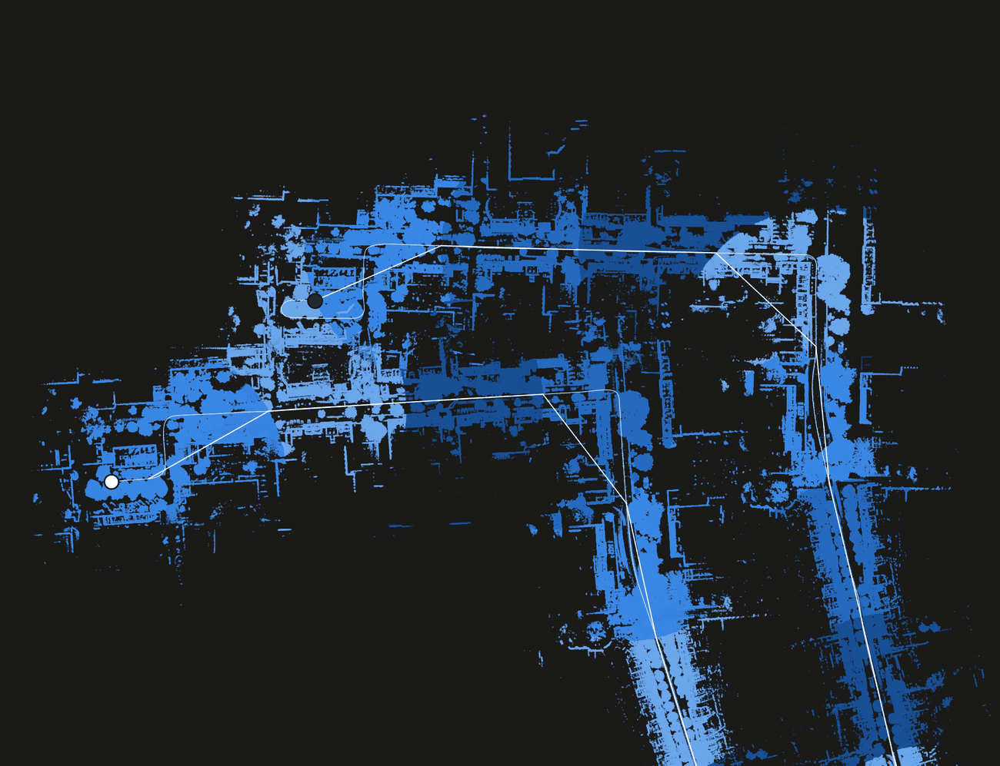
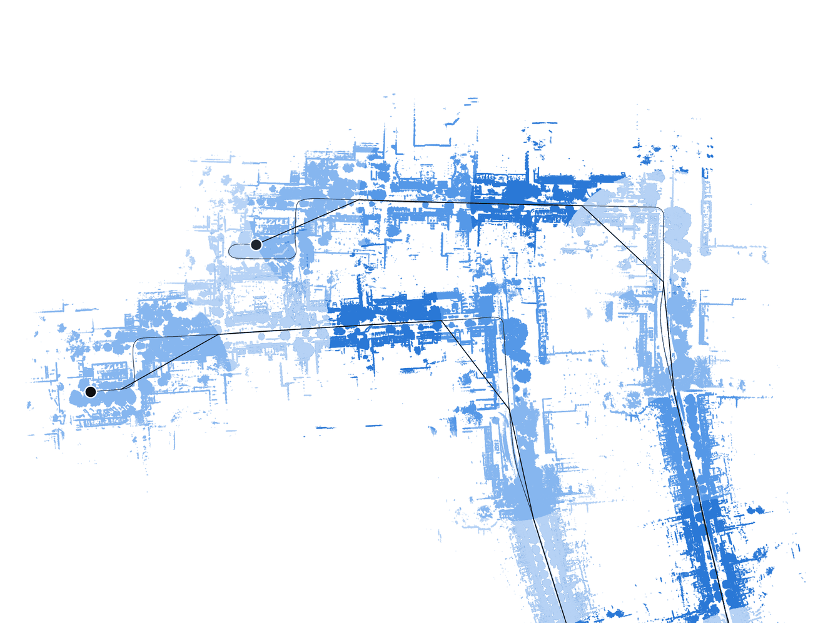
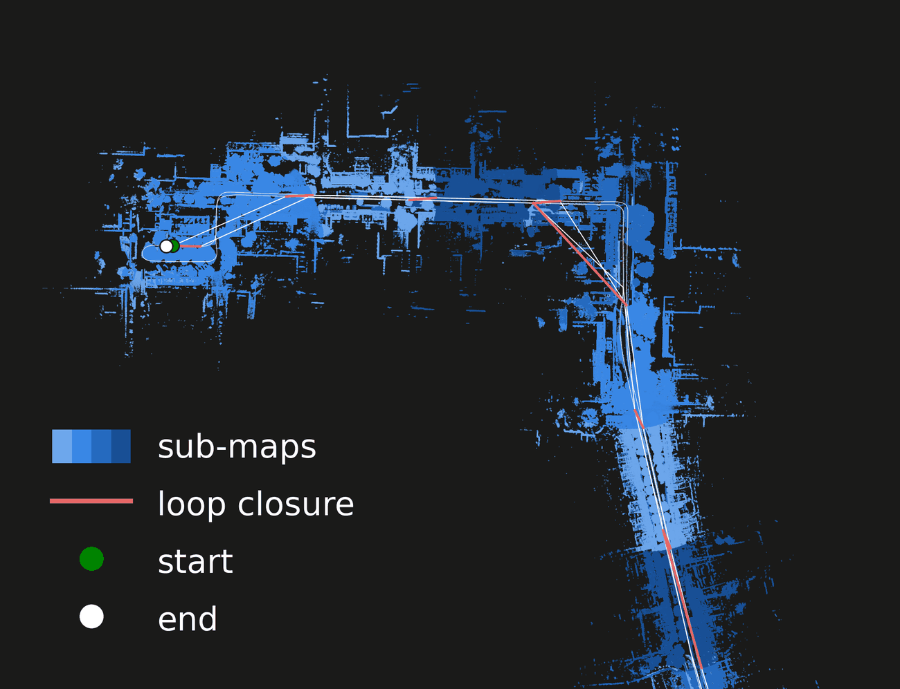
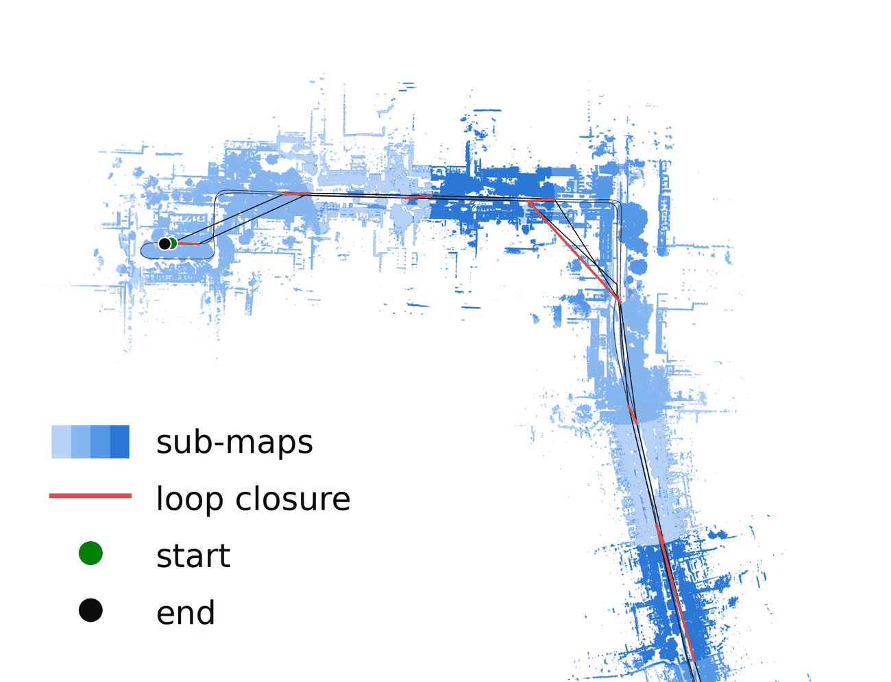
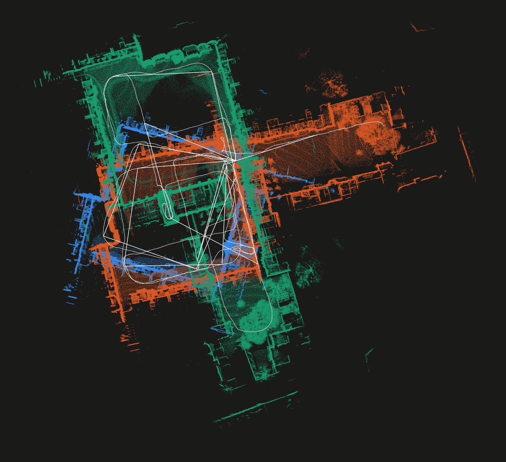
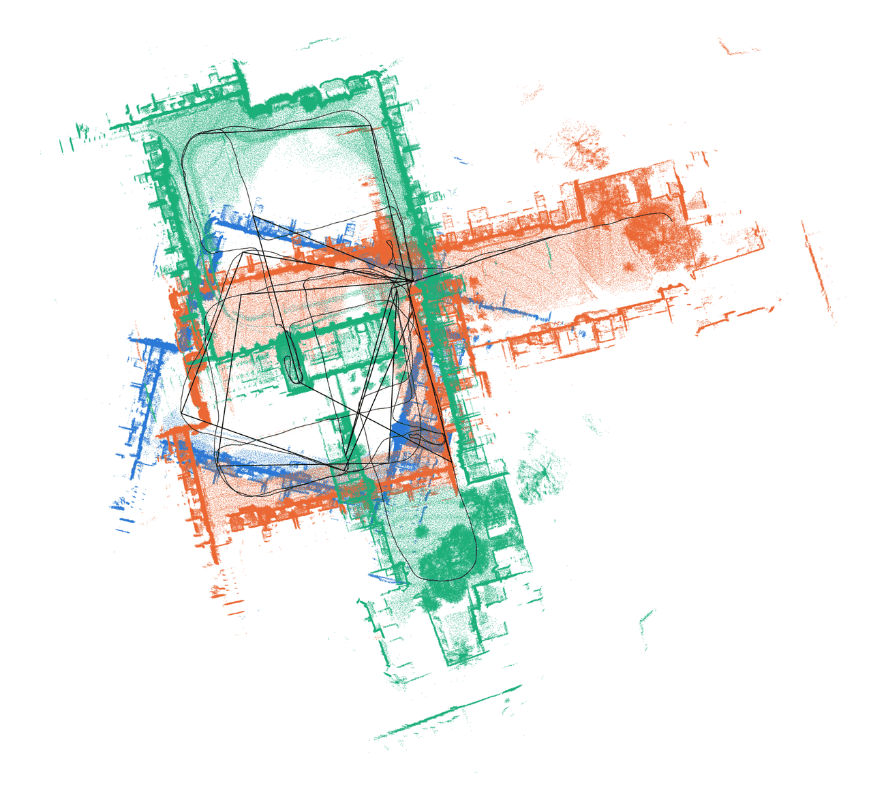
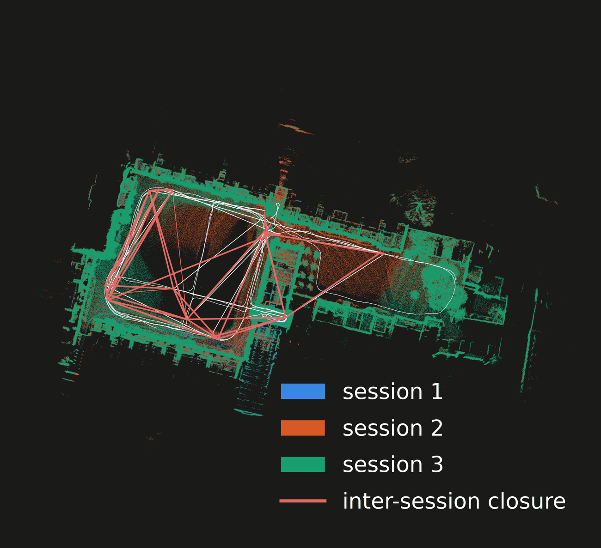
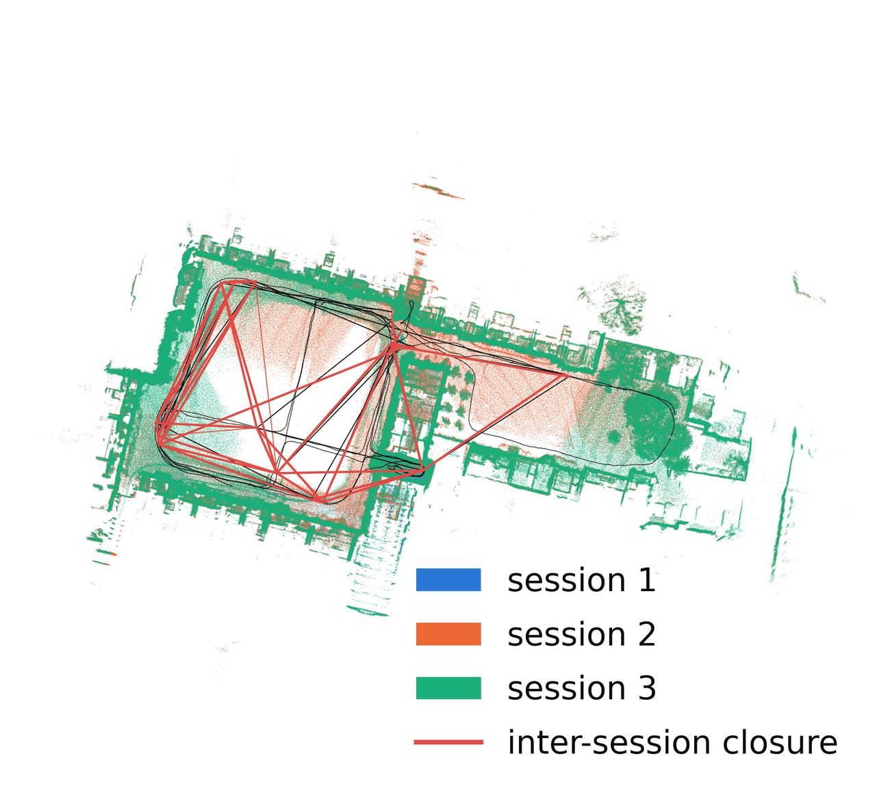

---
myst:
  html_meta:
    description: >-
      rko_slam is a ROS2 SLAM system on top of a LiDAR-inertial odometry: drift correction and
      multi-session alignment.
---

# rko_slam

**ROS2 SLAM on top of a LiDAR-inertial odometry: drift correction and multi-session alignment.**

<div class="pair">
  <figure><figcaption>rko_lio</figcaption></figure>
  <figure><figcaption>rko_slam</figcaption></figure>
</div>
<p class="pair-caption">A 3 km drive that ends where it started, with rko_lio, and with rko_slam running on top of it.</p>

An odometry tells you how you moved. Over a long enough run its estimate drifts, and when you come back to a
place you have been before, the two visits do not land on the same spot. rko_slam runs next to the odometry, uses the LiDAR,
recognizes the revisit, and corrects the whole trajectory behind you. You keep the odometry as it is, and you
additionally get a `map <- odom` correction on TF, a pose graph, and the sub-maps the system built along the way.

The odometry it assumes by default is [rko_lio](https://github.com/PRBonn/rko_lio), my LiDAR-inertial odometry
package. rko_lio is also a build dependency, rko_slam uses its voxel map and deskewing internally. At run time
though, any odometry that publishes `odom <- base` on TF and is locally consistent will do, wheel odometry included.

```bash
ros2 launch rko_slam slam.launch.py lidar_topic:=/rko_lio/deskewed_scan rviz:=true
```

## Multi-session alignment

The same detector works across runs, not just within one, as an offline step. Give it the run directories of several
sessions of the same place - different days, different directions, whatever - and it finds where they overlap
and solves all of them into one frame. No bags and no live topics, it only reads what the runs already dumped.
Merging can also tighten each session's own trajectory, not only place them in one frame.

<div class="pair">
  <figure><figcaption>as recorded</figcaption></figure>
  <figure><figcaption>aligned</figcaption></figure>
</div>
<p class="pair-caption">Three sessions of the same place, recorded on different days, and the one frame they end up in.</p>

```bash
ros2 launch rko_slam align.launch.py run_dirs:="[results/run_1, results/run_2]"
```

## Where to go

- {doc}`Build and run <pages/build_and_run>`: build it, run it online or on a bag, read what it publishes, use what it writes.
- {doc}`Configuration <pages/configuration>`: every parameter and what it does.
- {doc}`How it works <pages/how_it_works>`: sub-maps, closure detection, the pose graph, and how sessions are aligned.

## Citation

rko_slam is essentially a reimplementation of [KISS-SLAM](https://github.com/PRBonn/kiss-slam) for ROS2. If you
find it useful, consider leaving a star on [rko_slam](https://github.com/PRBonn/rko_slam) and on KISS-SLAM, and citing
the original publication:

```bibtex
@INPROCEEDINGS{kiss2025iros,
  author    = {Guadagnino, Tiziano and Mersch, Benedikt and Gupta, Saurabh and Vizzo, Ignacio and Grisetti, Giorgio and Stachniss, Cyrill},
  booktitle = {2025 IEEE/RSJ International Conference on Intelligent Robots and Systems (IROS)},
  title     = {{KISS-SLAM: A Simple, Robust, and Accurate 3D LiDAR SLAM System With Enhanced Generalization Capabilities}},
  year      = {2025},
  pages     = {5363-5370},
  doi       = {10.1109/IROS60139.2025.11246613}
}
```

If the default odometry, [rko_lio](https://github.com/PRBonn/rko_lio), was useful to you, consider a star there and citing its paper:

```bibtex
@article{malladi2026ral,
  author      = {M.V.R. Malladi and T. Guadagnino and L. Lobefaro and C. Stachniss},
  title       = {A Robust Approach for LiDAR-Inertial Odometry Without Sensor-Specific Modeling},
  journal     = {IEEE Robotics and Automation Letters},
  year        = {2026},
  volume      = {11},
  number      = {6},
  pages       = {7420--7427},
  doi         = {10.1109/LRA.2026.3685966},
}
```

```{toctree}
:hidden:

Build and run <pages/build_and_run>
Configuration <pages/configuration>
How it works <pages/how_it_works>
```
