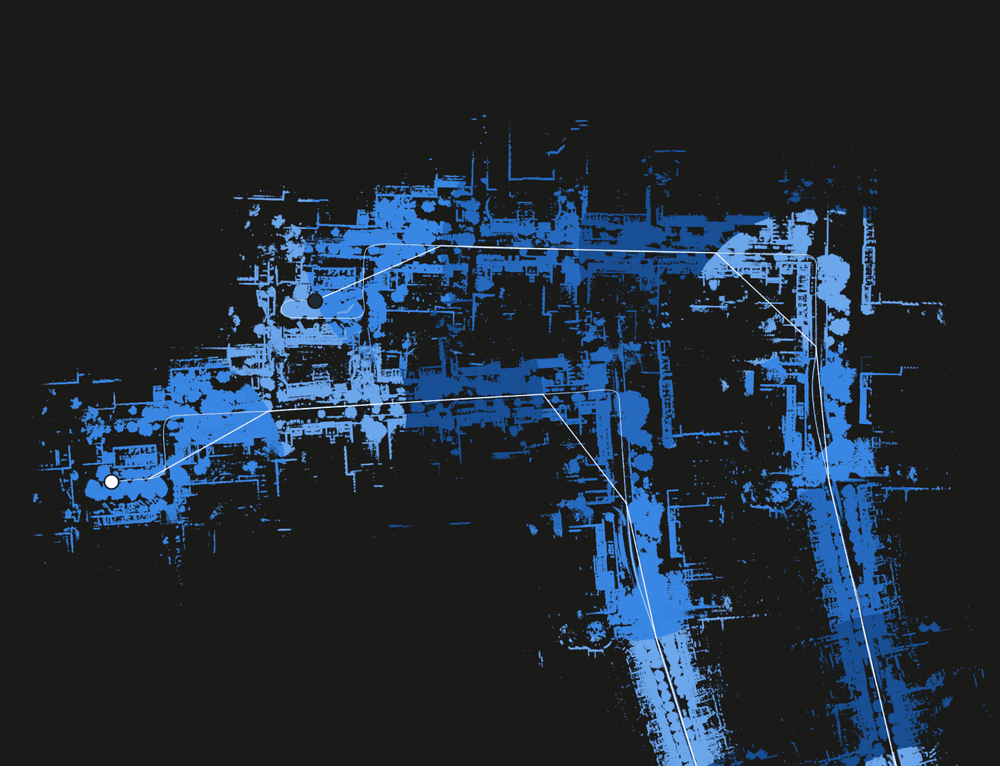
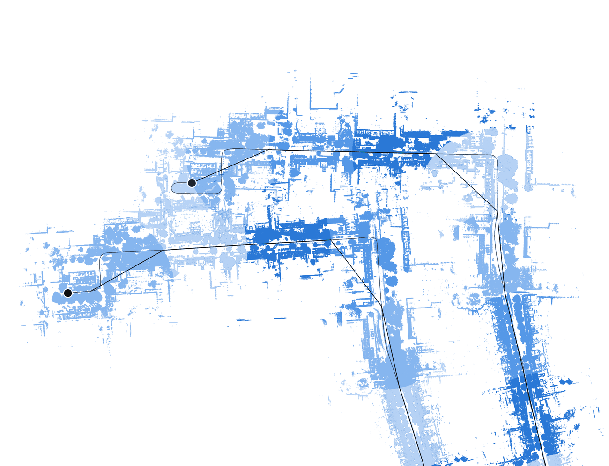
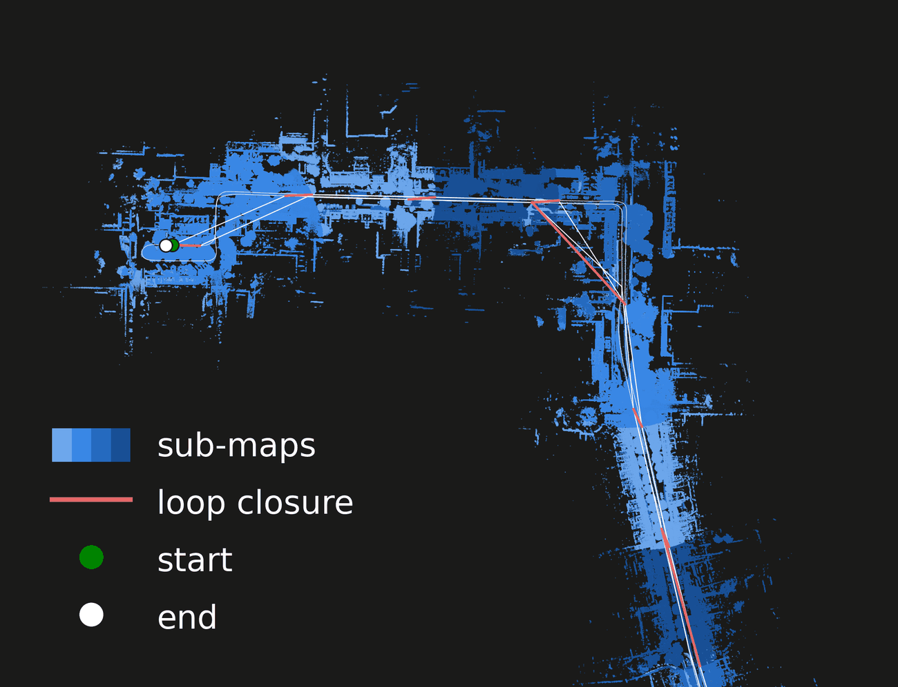
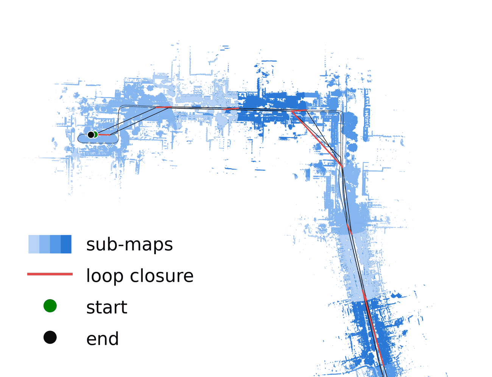
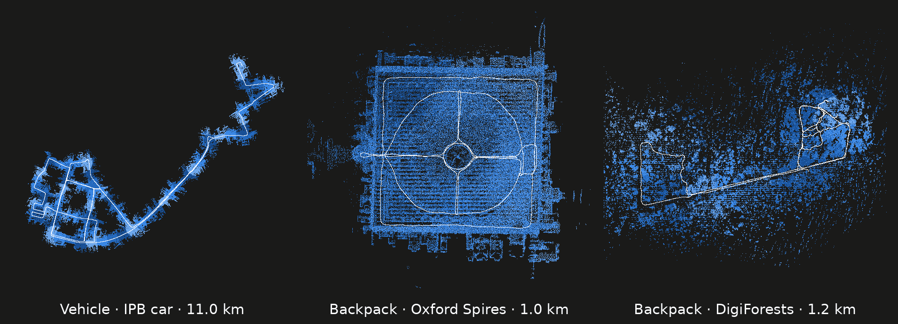
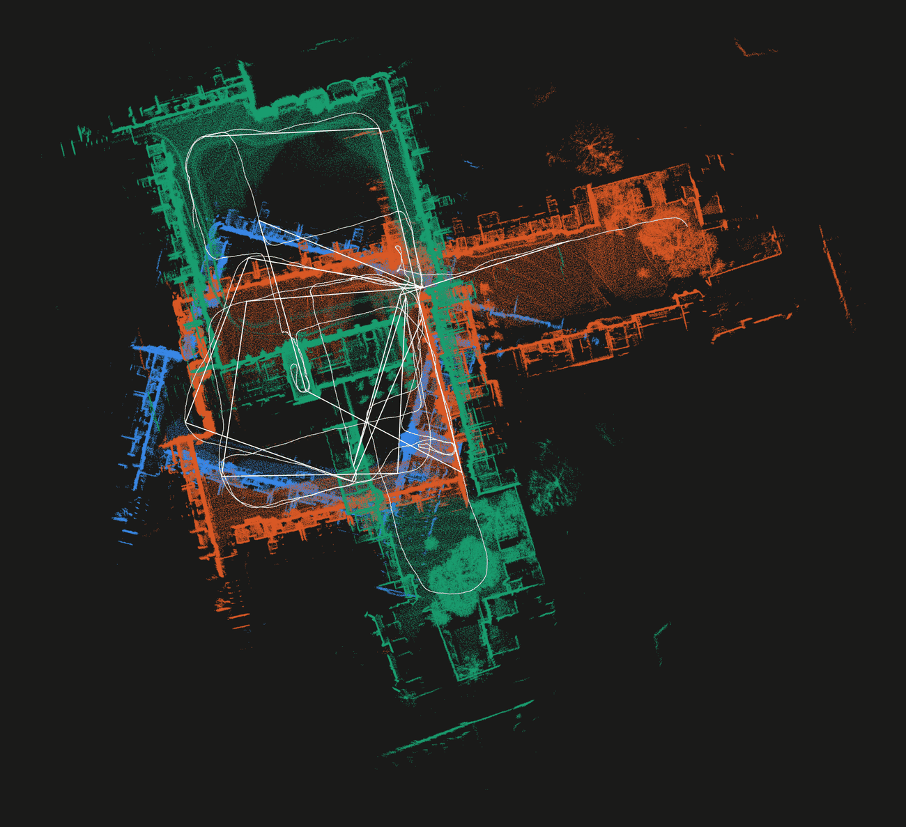
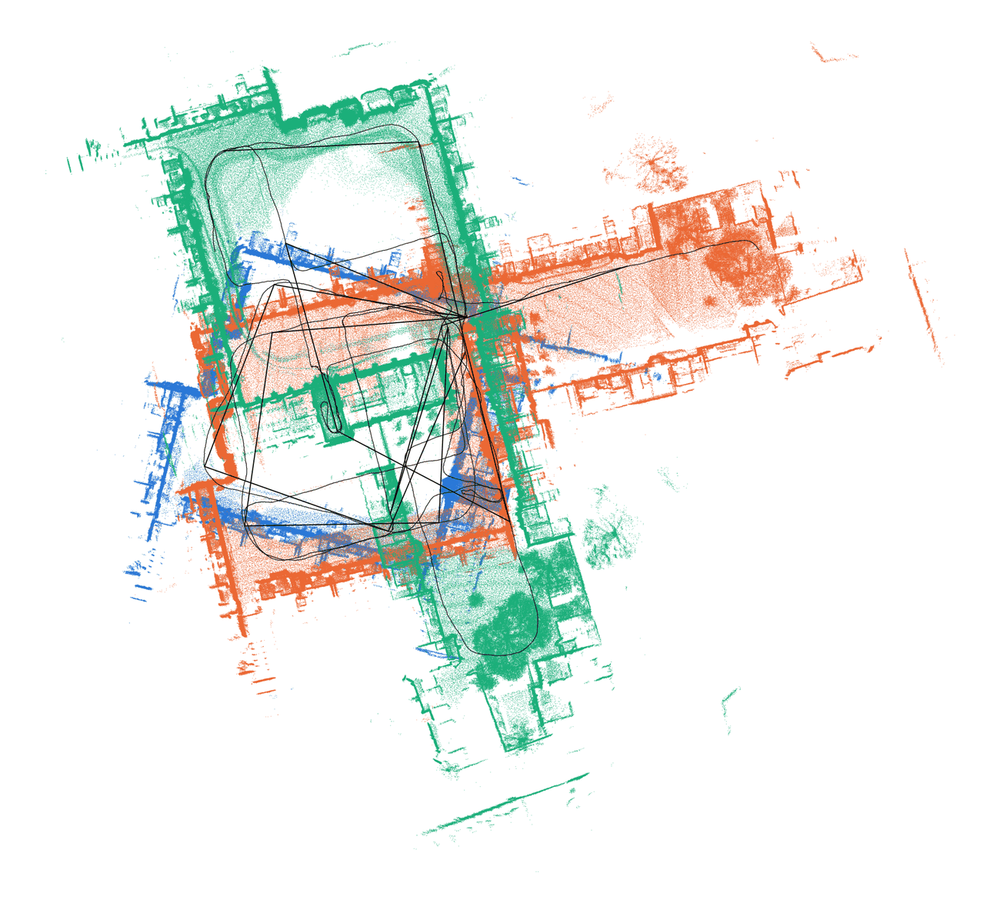
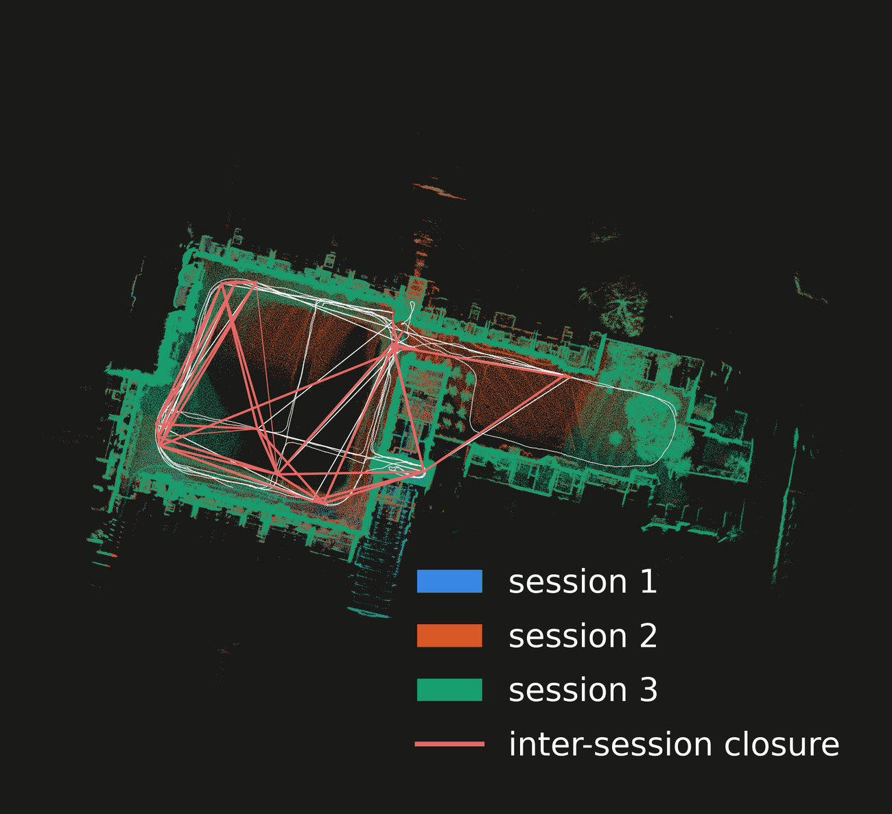
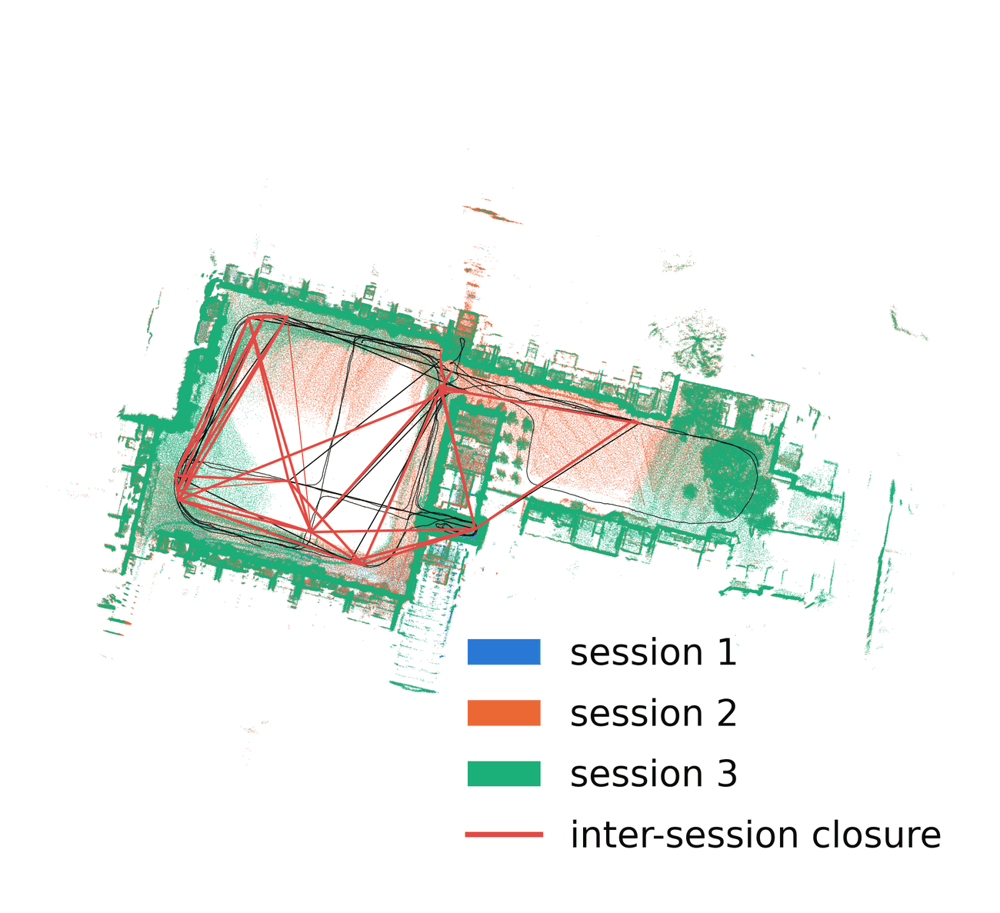

---
myst:
  html_meta:
    description: >-
      rko_slam is ROS2 LiDAR-inertial SLAM and multi-session alignment.
---

# rko_slam

**ROS2 LiDAR-inertial SLAM and multi-session alignment.**

<div class="pair">
  <figure><figcaption>rko_lio</figcaption></figure>
  <figure><figcaption>rko_slam</figcaption></figure>
</div>
<p class="pair-caption">Part of a 20 km drive that ends where it started, with rko_lio, and with rko_slam running on top of it.</p>

<figure>
  
  
</figure>

rko_slam runs on [rko_lio](https://github.com/PRBonn/rko_lio), my LiDAR-inertial odometry, or on your own odometry, and
publishes `map <- odom` on TF. With a LiDAR with per-point timestamps, an IMU, and a TF tree from both to your base
frame:

```bash
ros2 launch rko_slam odometry_and_slam.launch.py rviz:=true
```

## Multi-session alignment

<div class="pair">
  <figure><figcaption>as recorded</figcaption></figure>
  <figure><figcaption>aligned</figcaption></figure>
</div>
<p class="pair-caption">Three sessions of the same place, recorded on different days, and the one frame they end up in.</p>

Run each session with `dump_results:=true run_name:=day_1` (`day_2`, ...), then:

```bash
ros2 launch rko_slam align.launch.py run_dirs:="[results/day_1_0, results/day_2_0]"
```

## Where to go

- {doc}`Build and run <pages/build_and_run>`: build it, run it online or on a bag, read what it publishes, use what it
  writes.
- {doc}`Configuration <pages/configuration>`: every parameter and what it does.
- {doc}`How it works <pages/how_it_works>`: sub-maps, closure detection, the pose graph, and how sessions are aligned.

## Citation

If rko_slam is useful to you, leave a star on [GitHub](https://github.com/PRBonn/rko_slam).

rko_slam is part of my PhD thesis. Until the thesis is published, please cite
[rko_lio](https://github.com/PRBonn/rko_lio), which it shares its core with:

```bibtex
@article{malladi2026ral,
  author      = {M.V.R. Malladi and T. Guadagnino and L. Lobefaro and C. Stachniss},
  title       = {A Robust Approach for LiDAR-Inertial Odometry Without Sensor-Specific Modeling},
  journal     = {IEEE Robotics and Automation Letters},
  year        = {2026},
  volume      = {11},
  number      = {6},
  pages       = {7420--7427},
  doi         = {10.1109/LRA.2026.3685966},
}
```

rko_slam builds on [KISS-SLAM](https://github.com/PRBonn/kiss-slam); its first version was a reimplementation for ROS2.
Closure detection reimplements [MapClosures](https://github.com/PRBonn/MapClosures). Please cite KISS-SLAM as well:

```bibtex
@INPROCEEDINGS{kiss2025iros,
  author    = {Guadagnino, Tiziano and Mersch, Benedikt and Gupta, Saurabh and Vizzo, Ignacio and Grisetti, Giorgio and Stachniss, Cyrill},
  booktitle = {2025 IEEE/RSJ International Conference on Intelligent Robots and Systems (IROS)},
  title     = {{KISS-SLAM: A Simple, Robust, and Accurate 3D LiDAR SLAM System With Enhanced Generalization Capabilities}},
  year      = {2025},
  pages     = {5363-5370},
  doi       = {10.1109/IROS60139.2025.11246613}
}
```

```{toctree}
---
hidden:
---
Build and run <pages/build_and_run>
Configuration <pages/configuration>
How it works <pages/how_it_works>
```
