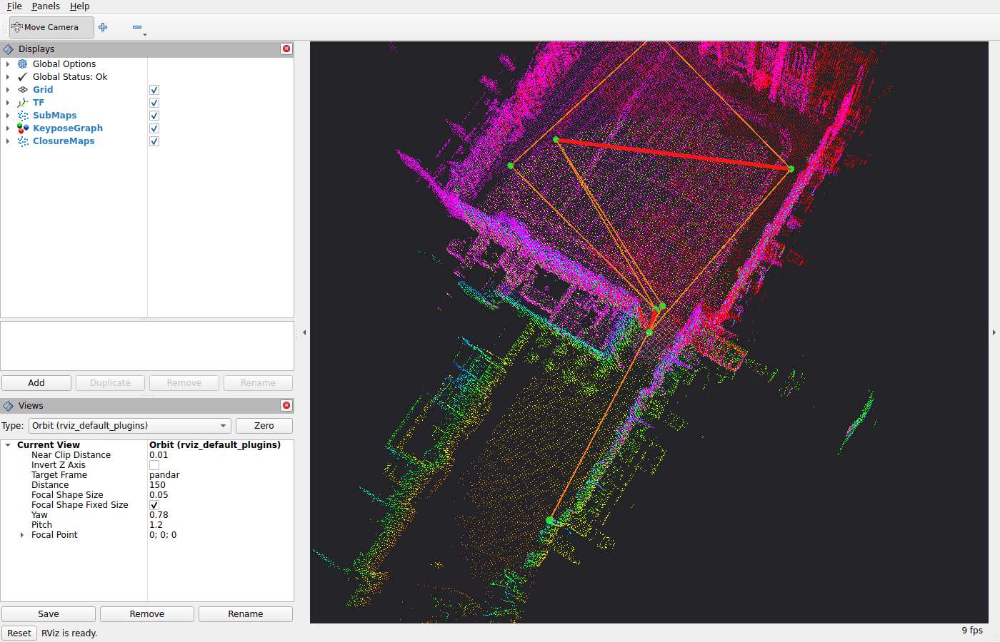

# Build and run

Supported distros: Jazzy, Kilted, Lyrical, Rolling.

## Build

rko_slam depends on [rko_lio](https://github.com/PRBonn/rko_lio) at build time, and for now both have to be
built in the same workspace.

```bash
cd <ws>/src
git clone https://github.com/PRBonn/rko_lio
git clone https://github.com/PRBonn/rko_slam
cd <ws> && rosdep install --from-paths src --ignore-src -y
colcon build --packages-select rko_lio rko_slam
```

Please note, as of right now using `rko_lio` via `sudo apt install ros-<distro>-rko-lio` is not supported. Please
clone master into your workspace as shown above. `apt` installs of both will be supported, same as with rko_lio
today.

Tests are off by default; add `-DRKO_SLAM_BUILD_TESTS=ON` to the cmake args and run
`colcon test --packages-select rko_slam`.

### Dependencies and quirks

Three dependencies - g2o, MapClosures and the UTL profiler - are fetched and pinned by CMake, always; nanoflann
and Catch2 are fetched too under `-DRKO_SLAM_FETCH_CONTENT_DEPS=ON` and found on the system otherwise. Sourcing
Eigen, Sophus, spdlog and tsl-robin-map relies on rko_lio, however you configure that (check rko_lio's
[ROS docs](https://prbonn.github.io/rko_lio/pages/ros.html)). Everything else resolves via rosdep.

Please note: rko_slam is MIT, but the g2o Cholmod solver links SuiteSparse's CHOLMOD, whose Ubuntu/Debian build
carries GPL-2+ modules.

Steps are planned to clean up the dependency requirements and support pure rosdep installs.

## Run

Two entrypoints: `slam.launch.py` (`mode:=online|offline`) and `align.launch.py`. `-s` lists every parameter
with its documentation, and anything you leave unset keeps the node's own default. What each parameter does is
on the {doc}`Configuration <configuration>` page.

```bash
ros2 launch rko_slam slam.launch.py -s
```

### Online

Next to a running rko_lio, give it rko_lio's deskewed scan. The base frame is found for you (see
[below](#what-gets-autodetected)):

```bash
ros2 launch rko_slam slam.launch.py lidar_topic:=/rko_lio/deskewed_scan
```

Add `rviz:=true` to open RViz with the default view: sub-maps, keypose graph and closures.

The same launch file can spawn the rko_lio front-end for you. rko_lio's `publish_deskewed_scan` is forced on and
rko_slam consumes that topic. Give `base_frame` here, since rko_lio is not running yet when it would be detected:

```bash
ros2 launch rko_slam slam.launch.py odometry:=true base_frame:=base_link \
  rko_lio_config_file:=my_rko_lio.yaml \
  rko_lio_lidar_topic:=/os_cloud_node/points rko_lio_imu_topic:=/os_cloud_node/imu
```

### The odometry

rko_lio is the default, not a requirement. rko_slam asks two things of the odometry: that its pose is on TF, as
described under [Frames](#frames), and that it is locally consistent, meaning the motion between two nearby scans is
right even if the whole trajectory drifts. The loop closing corrects the drift; it does not repair a jump. Any
LiDAR odometry qualifies. In my thesis the same back-end ran unchanged on top of
[Kinematic-ICP](https://github.com/PRBonn/kinematic-icp), which fuses a LiDAR with wheel odometry on a wheeled
robot.

With another odometry the scans are usually raw, so set `deskew:=true` and rko_slam deskews them itself with
the same TF:

```bash
ros2 launch rko_slam slam.launch.py deskew:=true
```

If the odometry publishes under other names, give `lidar_topic`, `base_frame` and `odom_frame` explicitly.

### Offline

Offline, the node self-drains a bag (every scan is processed faster than frame-rate if possible). The odometry
comes from the bag's own `/tf`:

```bash
ros2 launch rko_slam slam.launch.py mode:=offline bag_path:=/data/my_bag
```

If the odometry you want is not in the bag, `odom_tum_path` takes it from a TUM trajectory file instead, see
[Frames](#frames):

```bash
ros2 launch rko_slam slam.launch.py mode:=offline bag_path:=/data/my_bag odom_tum_path:=/data/odometry_tum.txt
```

Nothing is written unless you ask for it, see [Outputs](#outputs):

```bash
ros2 launch rko_slam slam.launch.py mode:=offline bag_path:=/data/my_bag \
  dump_results:=true results_dir:=results run_name:=my_run
```

### Multi-session alignment

`align.launch.py` is an offline step: it merges the run directories of several runs of the same place into one
frame. Every run directory must carry its sub-maps, i.e. have been run with `dump_results:=true` (sub-maps are
dumped by default):

```bash
ros2 launch rko_slam align.launch.py run_dirs:="[results/run_1, results/run_2]"
```

### What gets autodetected

`lidar_topic` is required and has no default, and `base_frame` is optional. With `autodetect:=true`, the
default, the launch file fills in whichever of the two you left unset:

- `lidar_topic` is the one `sensor_msgs/PointCloud2` topic there is. If several exist, the launch stops and lists
  them so you can pick. Next to a running rko_lio there are at least two, the raw scan and the deskewed one, so
  give `lidar_topic` in that case.
- `base_frame` is the first of `base_link`, `base_footprint`, `base` found in the TF tree, otherwise the scan's
  own `frame_id`. Either way the TF tree must connect it to the scan's frame, or the launch stops and says so.

Online this means waiting for the topics and TF to show up, `autodetect_timeout` (10 s) long. Offline it is read
from the bag. Anything you did give is used as is, and with both given nothing is detected at all;
`autodetect:=false` turns it off. With `odometry:=true`, `lidar_topic` is set to rko_lio's deskewed scan topic
and not searched for, but the base frame detection needs a message on that topic and rko_lio only starts
afterwards, so give `base_frame` too.

## Frames

rko_slam works in one frame, `base_frame`: the sub-maps, keyposes and trajectory are expressed in it. Left unset,
it is the scan's frame, the `frame_id` of the `PointCloud2`.

The odometry is the pose of `base_frame` in `odom_frame`, read from TF at each scan's timestamp. A static transform
on TF connects `base_frame` to the scan's frame, and rko_slam reads it once, on the first scan, to transform every
scan into `base_frame` before adding it to the sub-maps.

Offline, `odom_tum_path` takes the odometry from a TUM file instead of the bag's `/tf`. The file holds the pose of
`base_frame` in `odom_frame`.

rko_slam publishes `map_frame <- odom_frame`, which makes `map_frame <- base_frame` the SLAM estimate.

## Topics

Subscribed:

| Topic / frame | What |
|---|---|
| `lidar_topic` (`sensor_msgs/PointCloud2`) | the scans, deskewed unless `deskew:=true` |
| `odom_frame <- base_frame` on TF | the odometry, see [Frames](#frames) |

Published:

| Topic / frame | What |
|---|---|
| `map_frame <- odom_frame` on TF | the correction; `map_frame <- base_frame` is then the SLAM estimate |
| `rko_slam/sub_maps` (`PointCloud2`) | each closed sub-map, with a `sub_map_<i>` TF chain (`publish_sub_maps:=true`) |
| `rko_slam/keypose_graph` (`MarkerArray`) | the keyposes with their odometry and closure edges (`publish_keypose_graph:=true`) |
| `rko_slam/closure_maps` (`PointCloud2`) | each accepted closure pair as a two-tone cloud (`publish_closure_maps:=true`) |
| `rko_slam/bag_progress` (`Float32MultiArray`) | offline only, how far into the bag the node is |

## Visualization

Nothing is published for display unless you ask for it. Three publishers, each off by default:

- `publish_sub_maps:=true`, each closed sub-map as a point cloud on `rko_slam/sub_maps`, with a `sub_map_<i>` TF
  chain so RViz places them.
- `publish_keypose_graph:=true`, the keyposes as spheres with the odometry edges between consecutive keyposes and
  the closure edges, as markers on `rko_slam/keypose_graph`.
- `publish_closure_maps:=true`, each accepted closure as the two sub-maps it matched, one colour each, on
  `rko_slam/closure_maps`, so you can see what got matched to what.

`rviz:=true` turns all three on and opens RViz with the default view, `config/default.rviz`, patched with your
frames. With `odometry:=true` it also shows rko_lio's local map and deskewed scan. Pass your own config with
`rviz_config_file:=` and it is used unchanged, with nothing forced on.

<figure>
  
  <figcaption class="pair-caption">The default view at the end of an Oxford Spires sequence: sub-maps, the keypose graph with its odometry and closure edges, and one closure map in two tones.</figcaption>
</figure>


## Outputs

Nothing is written unless you ask for it. With `dump_results:=true`, a SLAM run (`slam.launch.py`) writes
`<results_dir>/<run_name>_<n>/`:

| File | What |
|---|---|
| `*_tum.txt` | the trajectory |
| `*_keypose_graph.g2o` | the keypose pose graph |
| `*_config.yaml` | the config dumped for reproducibility |
| `*_profile.txt` | profiling logs |
| `*_trajectory.png` | the trajectory as an image, loop closures in red |
| `sub_maps/sub_map_*.ply` | the sub-maps, one file each, in the frame of their keypose. Usable as a map for a localization system, and the input to `align.launch.py` (`dump_sub_maps`, on by default) |

`align.launch.py` always writes `<results_dir>/<run_name>_<n>/`, and needs the runs it merges to have been
written with `dump_results:=true`:

| File | What |
|---|---|
| `*_joint_keypose_graph.g2o` | the joint pose graph over all sessions |
| `*_session_<i>_tum.txt` | each session's trajectory in the joint frame, `<i>` in `run_dirs` order |
| `*_config.yaml` | the config dumped for reproducibility, with the run directories |
