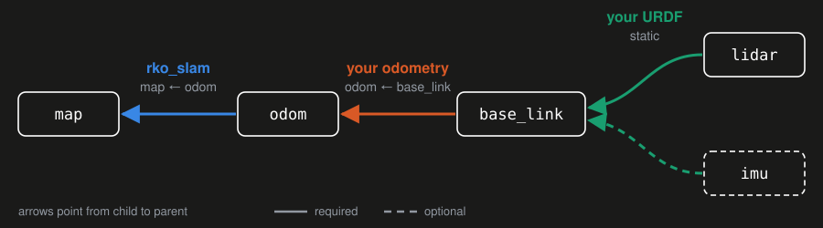
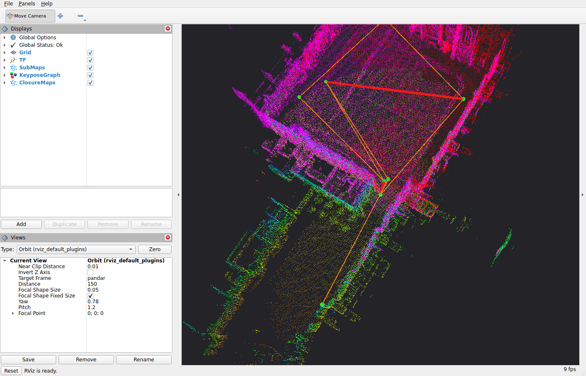

# Build and run

Supported distros: Jazzy, Kilted, Lyrical, Rolling.

## Build

rko_slam depends on [rko_lio](https://github.com/PRBonn/rko_lio) at build time, and both have to be built in the same
workspace.

```bash
cd <ws>/src
git clone https://github.com/PRBonn/rko_lio
git clone https://github.com/PRBonn/rko_slam
cd <ws> && rosdep install --from-paths src --ignore-src -y
colcon build --packages-select rko_lio rko_slam
```

Tests are off by default; add `-DRKO_SLAM_BUILD_TESTS=ON` to the cmake args and run
`colcon test --packages-select rko_slam`.

`-DRKO_SLAM_ENABLE_PROFILING=ON` makes a run report where its time went, in `*_profile.txt` of a SLAM run with
`dump_results:=true`.

## Run

Three entrypoints: `slam.launch.py` (`mode:=online|offline`), `odometry_and_slam.launch.py`, and `align.launch.py`. `-s`
lists every parameter with its documentation, and anything you leave unset keeps the node's own default. What each
parameter does is on the {doc}`Configuration <configuration>` page.

```bash
ros2 launch rko_slam slam.launch.py -s
```

### Online

Next to a running rko_lio, give rko_slam rko_lio's deskewed scan and the IMU rko_lio reads. rko_lio publishes that scan
with `publish_deskewed_scan:=true`, or with `rviz:=true` and its default view:

```bash
ros2 launch rko_slam slam.launch.py lidar_topic:=/rko_lio/deskewed_scan imu_topic:=/your/imu
```

The IMU levels the map, see {doc}`How it works <how_it_works>`. The IMU's frame has to be connected to `base_frame` by a
static transform on TF. Without an IMU, leave `imu_topic` unset.

Add `rviz:=true` to open RViz with the default view: sub-maps, keypose graph and closures.

To run the odometry too, use the other entrypoint, see [Running rko_lio with it](#running-rko_lio-with-it):

```bash
ros2 launch rko_slam odometry_and_slam.launch.py
```

From a bag, start `ros2 bag play <bag> --clock` first, then either launch with `use_sim_time:=true`.

### The odometry

rko_lio is the default. rko_slam asks two things of any odometry: that its pose is on TF, as described under
[Frames](#frames), and that it is locally consistent. The loop closing corrects the drift; it does not repair a jump.
Any LiDAR odometry qualifies. In my thesis the same back-end ran unchanged on top of
[Kinematic-ICP](https://github.com/PRBonn/kinematic-icp), which fuses a LiDAR with wheel odometry.

Raw scans need `deskew:=true`, and rko_slam deskews them itself with the same TF:

```bash
ros2 launch rko_slam slam.launch.py lidar_topic:=/points imu_topic:=/imu base_frame:=base_link deskew:=true
```

Deskewing needs per-point timestamps; a scan without them is dropped with a warning. rko_slam cannot tell a raw scan
from a deskewed one.

If its odometry frame is not `odom`, give `odom_frame` as well. If it publishes `odom_frame` as the TF child of
`base_frame`, set `invert_map_tf:=true`, and rko_slam publishes `map_frame` as the child of `odom_frame`.

### Offline

Offline, the node drains the bag as fast as it can process it. The odometry comes from the bag's own `/tf`:

```bash
ros2 launch rko_slam slam.launch.py mode:=offline bag_path:=/data/my_bag \
  lidar_topic:=/rko_lio/deskewed_scan imu_topic:=/imu
```

A raw sensor bag, with no odometry on `/tf`, gives repeated warnings and no trajectory, pose graph or sub-maps.
`odom_tum_path` takes the odometry from a TUM trajectory file instead, see [Frames](#frames):

```bash
ros2 launch rko_slam slam.launch.py mode:=offline bag_path:=/data/my_bag \
  lidar_topic:=/points imu_topic:=/imu base_frame:=base_link deskew:=true \
  odom_tum_path:=/data/odometry_tum.txt
```

`dump_results:=true` writes the run to disk, see [Outputs](#outputs):

```bash
ros2 launch rko_slam slam.launch.py mode:=offline bag_path:=/data/my_bag \
  lidar_topic:=/rko_lio/deskewed_scan imu_topic:=/imu \
  dump_results:=true results_dir:=results run_name:=my_run
```

### Multi-session alignment

`align.launch.py` is an offline step: it merges the run directories of several runs of the same place into one frame.
Each run directory must come from a run with `dump_results:=true`, hold its `sub_maps/` (`dump_sub_maps`, on by
default), and keep the name it was written with:

```bash
ros2 launch rko_slam align.launch.py run_dirs:="[results/day_1_0, results/day_2_0]"
```

### Running rko_lio with it

`odometry_and_slam.launch.py` starts an rko_lio online node next to rko_slam and wires the two together. It is online
only.

It sets these. Passing the rko_slam ones is an error:

| parameter                         | value                                                             |
| --------------------------------- | ----------------------------------------------------------------- |
| rko_lio's `publish_deskewed_scan` | true, it is what rko_slam subscribes to                           |
| rko_slam's `lidar_topic`          | rko_lio's deskewed scan topic                                     |
| rko_slam's `imu_topic`            | rko_lio's `imu_topic`, the IMU rko_lio reads                      |
| rko_slam's `deskew`               | false, that scan is already deskewed                              |
| rko_slam's `invert_map_tf`        | rko_lio's `invert_odom_tf`, so both publish in the same direction |

`base_frame`, `odom_frame` and `use_sim_time` are set once and passed to both nodes. Everything else is rko_slam's,
exactly as under `slam.launch.py`.

rko_lio's own settings, its raw `lidar_topic` and `imu_topic` among them, come from `rko_lio_config_file`, which turns
autodetection off. The file is rko_lio's flat format, without `ros__parameters`, and must set `lidar_topic`, `imu_topic`
and, unless given to this launch file, `base_frame`. It is used as it is, except that `publish_deskewed_scan` is forced
true and `base_frame`, `odom_frame` and `use_sim_time`, when given to this launch file, override it. A file that sets
`publish_deskewed_scan: false` is refused.

Without the file, rko_lio configures itself with its
[autodetection](https://prbonn.github.io/rko_lio/pages/ros.html#launch-parameter-autodetection), which needs:

- exactly one `sensor_msgs/PointCloud2` and exactly one `sensor_msgs/Imu` topic in the graph. With no `PointCloud2`
  topic, exactly one `point_cloud_interfaces/CompressedPointCloud2` topic is used instead;
- a non-empty TF tree, in which both sensor frames transform to the base frame once a message has arrived on each topic,
  so the static transforms must already be up. With `base_frame` passed, only the topics are looked up.

The base frame is the first of `base_link`, `base_footprint` and `base` on TF when the TF tree first appears. With none
of them, it is the LiDAR frame, and the odometry and map transforms are published inverted. Each wait gives up after
`autodetect_timeout` (10 s) of wall-clock time, so start the robot or the bag first. LiDAR and IMU messages that share
one `frame_id`, with no TF from it to a base frame, as with a Livox and its built-in IMU, need the config file with
identity extrinsics:

```yaml
lidar_topic: /livox/lidar
imu_topic: /livox/imu
base_frame: livox_frame
extrinsic_lidar2base_quat_xyzw_xyz: [0.0, 0.0, 0.0, 1.0, 0.0, 0.0, 0.0]
extrinsic_imu2base_quat_xyzw_xyz: [0.0, 0.0, 0.0, 1.0, 0.0, 0.0, 0.0]
```

For anything this does not allow, run rko_lio with its own launch file and rko_slam with `slam.launch.py`.

## Frames

<figure>
  
  
</figure>

rko_slam works in one frame, `base_frame`: the sub-maps, keyposes and trajectory are expressed in it. Left unset, it is
the scan's frame, its `frame_id`.

The odometry is the pose of `base_frame` in `odom_frame`, read from TF at each scan's timestamp. A static transform on
TF connects `base_frame` to the scan's frame, read once on the first scan. A second static transform connects
`base_frame` to the IMU's frame, read once on the first IMU message, after the first scan when `base_frame` is unset.

Offline, `odom_tum_path` takes the odometry from a TUM file instead of the bag's `/tf`. The file holds the pose of
`base_frame` in `odom_frame`.

rko_slam publishes `map_frame <- odom_frame`, which makes `map_frame <- base_frame` the SLAM estimate.

## Topics and transforms

Subscribed:

| Topic / transform                                                                           | What                                                                         |
| ------------------------------------------------------------------------------------------- | ---------------------------------------------------------------------------- |
| `lidar_topic` (`sensor_msgs/PointCloud2` or `point_cloud_interfaces/CompressedPointCloud2`) | the scans, taken as already deskewed unless you set `deskew:=true`           |
| `imu_topic` (`sensor_msgs/Imu`)                                                             | the IMU whose accelerometer levels the map, the same one your odometry reads |
| `odom_frame <- base_frame` on TF                                                            | the odometry, looked up at each scan's timestamp                             |
| `base_frame <- the scan's frame` on TF                                                      | static, read once on the first scan to bring every scan into `base_frame`    |
| `base_frame <- the IMU's frame` on TF                                                       | static, read once on the first IMU message                                   |

Published:

| Topic / transform                             | What                                                                                            |
| --------------------------------------------- | ----------------------------------------------------------------------------------------------- |
| `map_frame <- odom_frame` on TF               | the correction, flipped by `invert_map_tf`; `map_frame <- base_frame` is then the SLAM estimate |
| `rko_slam/sub_maps` (`PointCloud2`)           | each closed sub-map, with a `sub_map_<i>` TF chain (`publish_sub_maps:=true`)                   |
| `rko_slam/keypose_graph` (`MarkerArray`)      | the keyposes with their odometry and closure edges (`publish_keypose_graph:=true`)              |
| `rko_slam/closure_maps` (`PointCloud2`)       | each accepted closure pair as a two-tone cloud (`publish_closure_maps:=true`)                   |
| `rko_slam/bag_progress` (`Float32MultiArray`) | offline only, how far into the bag the node is                                                  |

## Visualization

Three publishers, each off by default:

- `publish_sub_maps:=true`, each closed sub-map as a point cloud on `rko_slam/sub_maps`, with a `sub_map_<i>` TF chain.
- `publish_keypose_graph:=true`, the keyposes as spheres with the odometry edges between consecutive keyposes and the
  closure edges, as markers on `rko_slam/keypose_graph`.
- `publish_closure_maps:=true`, each accepted closure as the two sub-maps it matched, one colour each, on
  `rko_slam/closure_maps`.

`rviz:=true` turns all three on and opens RViz with the default view, `config/default.rviz`, set to your frames. Under
`odometry_and_slam.launch.py` it also shows rko_lio's deskewed scan and its local map; with your own
`rko_lio_config_file`, the local map shows only if that file publishes one. Pass your own config with
`rviz_config_file:=` and it is used unchanged, with nothing forced on.

<figure>
  
  <figcaption class="pair-caption">The default view at the end of an Oxford Spires sequence: sub-maps, the keypose graph with its odometry and closure edges, and one closure map in two tones.</figcaption>
</figure>

## Outputs

With `dump_results:=true`, a SLAM run writes `<results_dir>/<run_name>_<n>/`, `run_name` defaulting to `rko_slam` online
and to the bag's name offline:

| File                     | What                                                                                                                             |
| ------------------------ | -------------------------------------------------------------------------------------------------------------------------------- |
| `*_tum.txt`              | the trajectory                                                                                                                   |
| `*_keypose_graph.g2o`    | the keypose pose graph, in g2o text with rko_slam's own comment lines and gravity edges; its edge weights are in `*_config.yaml` |
| `*_config.yaml`          | the config the run used                                                                                                          |
| `*_profile.txt`          | profiling logs, with `-DRKO_SLAM_ENABLE_PROFILING=ON`                                                                            |
| `*_trajectory.png`       | the trajectory as an image, loop closures in red                                                                                 |
| `sub_maps/sub_map_*.ply` | the sub-maps, each in the frame of its keypose, and the input to `align.launch.py` (`dump_sub_maps`, on by default)              |

When it aligns at least two sessions, `align.launch.py` writes `<results_dir>/<run_name>_<n>/`:

| File                        | What                                                                                                                        |
| --------------------------- | --------------------------------------------------------------------------------------------------------------------------- |
| `*_joint_keypose_graph.g2o` | the joint pose graph over all sessions                                                                                      |
| `*_session_<i>_tum.txt`     | each aligned session's trajectory in the joint frame, `<i>` in `run_dirs` order; a session with no closure path is left out |
| `*_config.yaml`             | the config the run used, with the run directories                                                                           |
