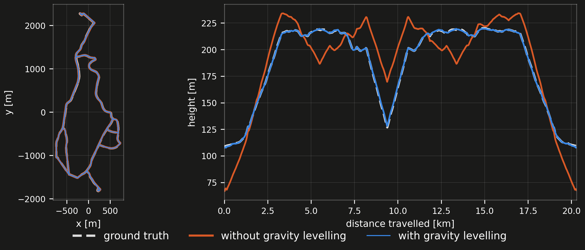
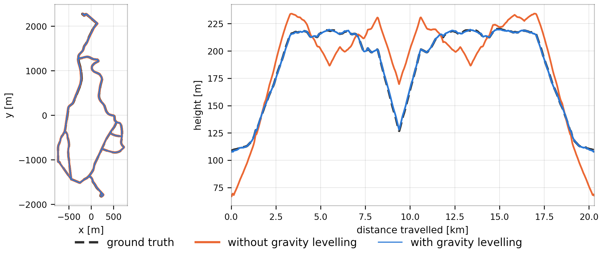

# How it works

rko_slam consumes the scan stream and the odometry TF of a running odometry (rko_lio by default, or anything locally
consistent publishing `odom <- base`), reads the same IMU that odometry reads, and publishes a `map <- odom` correction.
The pipeline is inspired by [KISS-SLAM](https://github.com/PRBonn/kiss-slam), reimplements
[MapClosures](https://github.com/PRBonn/MapClosures) for detecting revisits, and a pose graph.

## Sub-maps

The system does not maintain a single global map but splits the trajectory into local maps, or sub-maps. Each sub-map is
anchored at a keypose, the pose estimate at which it is opened, and holds a voxel grid of the local map points expressed
in the keypose frame. It integrates each new deskewed scan into the open sub-map with its odometry pose, looked up on TF
at the scan's timestamp. Points closer than `min_range` or further than `max_range` never enter, `voxel_size` sets the
cell, and `max_points_per_voxel` caps how many points a cell keeps.

The system closes a sub-map once the current pose is `splitting_distance` away from its keypose and opens a new one,
seeding its keypose from the composition of the old keypose and the odometry accumulated since. That breaks the
trajectory into locally consistent segments. This is straight-line displacement, not distance travelled - a 700 m loop
that never gets more than 80 m from where it started is one sub-map, not seven.

## The pose graph

The sub-map keyposes form the nodes of the pose graph, connected by the relative odometry between consecutive keyposes
as edge constraints, so that correcting the keyposes corrects the whole trajectory.

The odometry gives no uncertainty for these poses, so the edges carry a fixed covariance: a block-diagonal information
matrix with isotropic translation and rotation blocks, the rotation block set to a fixed multiple of the translation
block. That multiple is `rotation_info_scale`, and it accounts for the scale difference between the metre-scale
translation and radian-scale rotation residuals.

## Finding a revisit

Whenever a sub-map is completed, the system searches for loop closures between it and all previously built sub-maps.
That search runs on its own thread, so the scan stream keeps moving while it works.

The search levels the local map - onto the up the IMU measured for it, or onto the ground plane it identifies when there
is no IMU - and projects it into a bird's eye view density image (`density_map_resolution` is its cell size,
`density_threshold` decides when a cell counts as occupied), and computes binary ORB descriptors, which it matches
against the descriptors of all previous sub-maps. `hamming_distance_threshold` is how different two descriptors may be
and still be called a match, and `no_of_sub_maps_to_skip` keeps the most recent sub-maps out of the search so a sub-map
does not match its own neighbours.

RANSAC validates a matching candidate geometrically and gives an initial alignment, and `inliers_threshold` is how many
of the feature matches must agree on that alignment for it to go further. Point-to-plane ICP then refines it between the
two sub-maps' voxel centroids, into a relative closure transform that maps the keypose frame of one sub-map into that of
the other.

The system then measures how much the two sub-maps overlap, as the number of voxels they share after aligning divided by
the size of the smaller one, so 0 to 1. That is what `overlap_threshold` gates.

## Closing the loop

The system inserts an accepted closure as a new edge, with a Cauchy robust kernel on it to down-weight inconsistent or
outlier closures, and re-solves the graph immediately (Dogleg). The keyposes move, it rebuilds the trajectory from them
and publishes the difference between where the odometry thinks you are and where the graph now says you are as
`map <- odom`.

## Keeping the map level

  <figure></figure>

A 20 km drive against ground truth, the same odometry under both runs. In x-y the two are indistinguishable; in height, the unlevelled run swings through ±40 m while the levelled one stays within a metre.

Every sub-map closed by a split also measures which way is up. As the sub-map is built, the system rotates each
accelerometer reading into the keypose frame with the odometry's rotation at that reading's time and sums them. At the
split it averages the sum, estimates the platform's mean acceleration over the same span from the odometry trajectory by
finite differences, and subtracts that. What is left is mostly gravity.

The system turns that direction into a unary edge on the keypose, weighted by `gravity_info_scale`. The edge pulls the
keypose's up axis onto the measured one, constraining roll and pitch and leaving the rest to the other edges. For the
global gauge as well, it only holds the first keypose in position and yaw, since global roll and pitch are observable
through gravity. When a run is finished, the pose graph gets dumped with the gravity edges as well, so a multi-session
alignment can build the same edges from it. When the system is not using an IMU (which is optional), there are no
gravity edges to build, and the gauge is fixed by holding the first keypose entirely.

## Across sessions

  <figure><figcaption>as recorded</figcaption></figure>
  <figure><figcaption>aligned</figcaption></figure>

Three sessions of the same place, recorded on different days, each starting in its own frame, and after alignment.

Every run ends in its own frame, wherever the odometry happened to start. Multi-session alignment treats each continuous
operation as one session and merges several of them into one common frame, reusing the single-session components and
detecting inter-session closures through the same place recognition.

It runs offline on the artifacts each completed session produces, the sub-maps with their keyposes and the per-session
pose graph, without reprocessing the raw sensor data. It rebuilds the closure detector from the stored sub-maps and
searches it for closures between sessions, since the closures within each session are already part of its own pose
graph, and validates them with the same overlap criterion as before.

Each session is internally consistent in its own frame, and a single inter-session closure fixes that session's frame
relative to a neighbour's. The sessions and their accepted inter-session closures form a graph, and it computes a
spanning tree over it, rooted at the session that reaches the most others. Composing the closure transforms along each
tree path places every session in the common frame, giving an initial guess for its keyposes. It leaves out any session
with no closure path to the root, with a warning.

It then builds a single pose graph over the keyposes of all sessions, adding each session's own odometry and closures
together with every accepted inter-session closure as edges, plus the gravity edge of every sub-map whose session graph
carries one. It fixes the gauge at the first keypose of the root session the same way, holding its position and yaw
where there are gravity edges and the whole pose where there are none. Optimizing this joint graph gives every session's
trajectory in the common frame, and it writes those, with the joint graph, to a new run directory. Beyond placing the
sessions in one frame, the joint optimization can also improve the trajectory consistency within each session.

The closure parameters are the same as for a single run, except `no_of_sub_maps_to_skip`, which is 0 here since
neighbouring sub-maps from different sessions are real candidates. `overlap_threshold` is the one that matters: where
the physical overlap between two recordings is small, lower it accordingly. How to run it is on the
{doc}`Build and run <build_and_run>` page.
