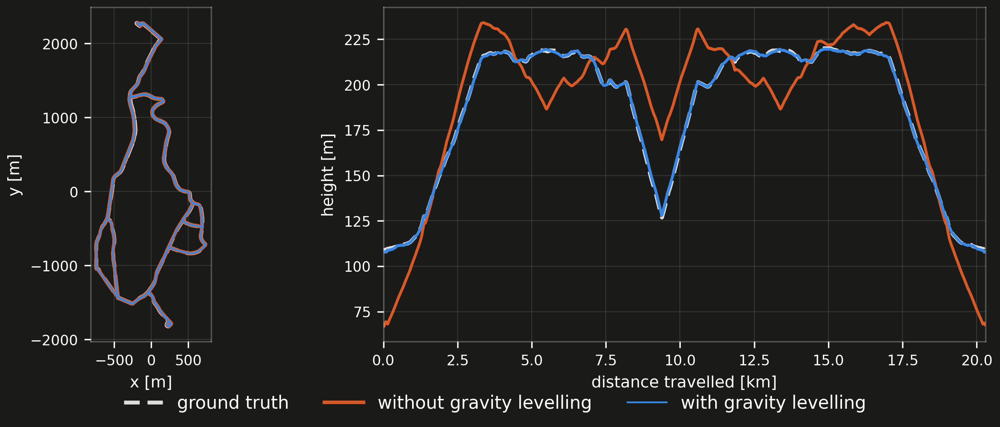

# How it works

An odometry tells you how you moved. Over a long run its estimate drifts, and when you come back to a place you have
been, the two visits do not land on the same spot. rko_slam runs next to the odometry, recognizes the revisit, and
corrects the whole trajectory behind you. The odometry stays as it is; you additionally get a `map <- odom` correction
on TF, a pose graph, and the sub-maps built along the way.

rko_slam reads the scan stream and the `odom <- base` TF of a running odometry, rko_lio by default or any locally
consistent one, and the IMU that odometry reads. The pipeline is inspired by
[KISS-SLAM](https://github.com/PRBonn/kiss-slam): it reimplements [MapClosures](https://github.com/PRBonn/MapClosures)
to detect revisits and corrects the trajectory with a pose graph.

## Sub-maps

Instead of one global map, the system splits the trajectory into sub-maps. Each sub-map is anchored at a keypose, the
pose at which it opens, and holds a voxel grid of the local map points in the keypose frame. Each new deskewed scan goes
into the open sub-map at its odometry pose, looked up on TF at the scan's timestamp. Points closer than `min_range` or
further than `max_range` never enter, `voxel_size` sets the cell, and `max_points_per_voxel` caps how many points a cell
keeps.

The system closes a sub-map once the current pose is `splitting_distance` away from its keypose and opens a new one,
seeding its keypose from the composition of the old keypose and the odometry accumulated since. This is straight-line
displacement, not distance travelled: a 700 m loop that never gets more than 40 m from where it started is one sub-map,
not fourteen.

## The pose graph

The sub-map keyposes are the nodes of the pose graph, connected by the relative odometry between consecutive keyposes,
so correcting the keyposes corrects the whole trajectory.

The odometry gives no uncertainty for these poses, so the edges carry a fixed weight: a block-diagonal information
matrix with isotropic translation and rotation blocks, the rotation block `rotation_info_scale` times the translation
block. That scale balances metre-scale translation residuals against radian-scale rotation residuals.

## Finding a revisit

Whenever a sub-map is completed, the system searches for closures between it and the earlier sub-maps, on its own
thread, so the scan stream keeps moving while it works.

The search levels the sub-map, onto the up the IMU measured for it, or onto the ground plane under it where there is
none, and projects its points into a bird's eye view density image: `density_map_resolution` is the cell size, and
`density_threshold` decides when a cell counts as occupied. It computes binary ORB descriptors on that image and matches
them against those of the earlier sub-maps. `hamming_distance_threshold` is how different two descriptors may be and
still match, and `no_of_sub_maps_to_skip` keeps the most recent sub-maps out of the search so a sub-map does not match
its own neighbours.

RANSAC checks the matches with each earlier sub-map for one consistent alignment, and the sub-map with the most inliers
goes further if at least `inliers_threshold` matches agree. Point-to-plane ICP then refines that alignment between the
two sub-maps' voxel centroids, into a closure transform from the keypose frame of one sub-map into that of the other.

The system then measures the overlap of the two aligned sub-maps: the voxels they share divided by the voxel count of
the smaller one, from 0 to 1. `overlap_threshold` gates that.

## Closing the loop

The system inserts an accepted closure as a new edge, with a Cauchy robust kernel that down-weights closures
inconsistent with the rest of the graph, and re-solves the graph immediately (Dogleg). The keyposes move, and the system
publishes the difference between where the odometry thinks you are and where the graph now says you are as
`map <- odom`.

## Keeping the map level

  <figure></figure>

A 20 km drive against ground truth, the same odometry under both runs. In x-y the two are indistinguishable; in height, the unlevelled run swings through ±40 m while the levelled one stays within a few metres.

Every sub-map also measures which way is up. As the sub-map is built, the system rotates each accelerometer reading into
the keypose frame with the odometry's rotation at that reading's time and sums them. When the sub-map closes, it
averages the sum, estimates the platform's mean acceleration over the same span from the odometry trajectory by finite
differences, and subtracts that. What is left is the reaction to gravity, the measured up.

The system turns that direction into a unary edge on the keypose, weighted by `gravity_info_scale`. The edge pulls the
map's up axis, as seen from the keypose, onto the measured up, constraining roll and pitch and leaving the rest to the
other edges. The gauge then holds only the first keypose's position and yaw, since gravity makes global roll and pitch
observable. The pose graph a run dumps carries its gravity edges, so multi-session alignment builds the same edges from
it. Without an IMU there are no gravity edges, and the gauge holds the first keypose entirely.

## Across sessions

  <figure><figcaption>as recorded</figcaption></figure>
  <figure><figcaption>aligned</figcaption></figure>

Three sessions of the same place, recorded on different days, each starting in its own frame, and after alignment.

Every run ends in its own frame, wherever the odometry happened to start. Multi-session alignment treats each run as one
session and merges several of them into one common frame, detecting closures between them with the same place
recognition.

It runs offline on what each session dumped, its sub-maps, pose graph and trajectory, without reprocessing the raw
sensor data. It rebuilds the closure detector from the stored sub-maps and searches it only for closures between
sessions, since each session's own closures are already in its pose graph, and validates them with the same overlap
criterion.

Each session is consistent in its own frame, so a single inter-session closure fixes that session's frame relative to a
neighbour's. The sessions and their accepted inter-session closures form a graph, and the alignment computes a spanning
tree over it, rooted at the session that reaches the most others. Composing the closure transforms along each tree path
places every session in the common frame, giving an initial guess for its keyposes. A session with no closure path to
the root is left out, with a warning.

It then builds a single pose graph over the keyposes of all sessions, with each session's own odometry, closure and
gravity edges, and every accepted inter-session closure. The gauge sits on the first keypose of the root session, as in
a single run: its position and yaw where there are gravity edges, the whole pose where there are none. Optimizing this
joint graph gives every session's trajectory in the common frame, and it writes those, with the joint graph, to a new
run directory. The joint optimization can also improve each session's own consistency.

The closure parameters are the same as for a single run, except `no_of_sub_maps_to_skip`, which is 0 here since
neighbouring sub-maps from different sessions are real candidates. `overlap_threshold` is the one that matters: lower it
where two recordings share little of the place. How to run it is on the {doc}`Build and run <build_and_run>` page.
